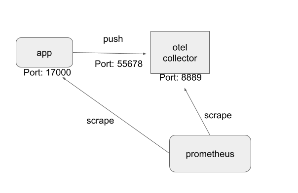

## Intro
The idea is to briefly demonstrate the following architecture covering two use cases

a) export metrics from the app side for Prometheus to scrape them directly

b) push metrics from the app to the collector and let the latter to export them



## How to run
Start with the collector running as a central local service:
```bash
docker run --rm -p 13133:13133 -p 14250:14250 -p 14268:14268 \
-p 55678-55680:55678-55680 -p 6060:6060 -p 7276:7276 -p 8888:8888 -p 8889:8889 \
-p 9411:9411 -p 9943:9943 \
-v "$(pwd)/local.yaml":/otel-local-config.yaml \
--name otelcol otel/opentelemetry-collector \
--config /otel-local-config.yaml otel/opentelemetry-collector-dev:latest```
```

Start the app:

```bash
go run ./cmd/testapp/main.go 
Starting local example
Prometheus server running on :17000
Exporting OTLP to :55680```

You should get output as follows at the collector stdout:

```

```bash
Metric #26
Descriptor:
     -> Name: test_app.go.num_forced_gc
     -> Description: The number of GC cycles that were forced by the application calling the GC function.
     -> Unit: 
     -> DataType: IntSum
     -> IsMonotonic: false
     -> AggregationTemporality: AGGREGATION_TEMPORALITY_CUMULATIVE
IntDataPoints #0
Data point labels:
     -> app_name: testapp
StartTime: 1611838376310829445
Timestamp: 1611838554311065697
Value: 0

```

Metrics are exported at the 0.0.0.0:8889 port (from the collector container). 
Same metrics are exposed locally from the app at port http://localhost:17000.
Here is a dump:
```
# HELP test_app_go_alloc The number of bytes of allocated heap objects.
# TYPE test_app_go_alloc gauge
test_app_go_alloc{app_name="testapp",host_name="easy.box",name="stavros",service_name="testapp",telemetry_sdk_language="go",telemetry_sdk_name="opentelemetry",telemetry_sdk_version="0.16.0"} 3.539416e+06
# HELP test_app_go_bucket_hash_sys The number of bytes of memory in profiling bucket hash tables.
# TYPE test_app_go_bucket_hash_sys gauge
test_app_go_bucket_hash_sys{app_name="testapp",host_name="easy.box",name="stavros",service_name="testapp",telemetry_sdk_language="go",telemetry_sdk_name="opentelemetry",telemetry_sdk_version="0.16.0"} 1.444539e+06
# HELP test_app_go_frees The cumulative count of heap objects freed.
# TYPE test_app_go_frees gauge
test_app_go_frees{app_name="testapp",host_name="easy.box",name="stavros",service_name="testapp",telemetry_sdk_language="go",telemetry_sdk_name="opentelemetry",telemetry_sdk_version="0.16.0"} 390
# HELP test_app_go_gc_cpu_fraction The fraction of this program's available CPU time used by the GC since the program started.
# TYPE test_app_go_gc_cpu_fraction gauge
test_app_go_gc_cpu_fraction{app_name="testapp",host_name="easy.box",name="stavros",service_name="testapp",telemetry_sdk_language="go",telemetry_sdk_name="opentelemetry",telemetry_sdk_version="0.16.0"} 0
# HELP test_app_go_heap_alloc The number of bytes of allocated heap objects.
# TYPE test_app_go_heap_alloc gauge
test_app_go_heap_alloc{app_name="testapp",host_name="easy.box",name="stavros",service_name="testapp",telemetry_sdk_language="go",telemetry_sdk_name="opentelemetry",telemetry_sdk_version="0.16.0"} 3.539416e+06
# HELP test_app_go_heap_idle The number of bytes in idle (unused) spans.
# TYPE test_app_go_heap_idle gauge
test_app_go_heap_idle{app_name="testapp",host_name="easy.box",name="stavros",service_name="testapp",telemetry_sdk_language="go",telemetry_sdk_name="opentelemetry",telemetry_sdk_version="0.16.0"} 6.1390848e+07
# HELP test_app_go_heap_inuse The number of bytes in in-use spans.
# TYPE test_app_go_heap_inuse gauge
test_app_go_heap_inuse{app_name="testapp",host_name="easy.box",name="stavros",service_name="testapp",telemetry_sdk_language="go",telemetry_sdk_name="opentelemetry",telemetry_sdk_version="0.16.0"} 4.800512e+06
# HELP test_app_go_heap_objects Number of allocated heap objects
# TYPE test_app_go_heap_objects gauge
test_app_go_heap_objects{app_name="testapp",host_name="easy.box",name="stavros",service_name="testapp",telemetry_sdk_language="go",telemetry_sdk_name="opentelemetry",telemetry_sdk_version="0.16.0"} 14547
# HELP test_app_go_heap_released The number of bytes of physical memory returned to the OS.
# TYPE test_app_go_heap_released gauge
test_app_go_heap_released{app_name="testapp",host_name="easy.box",name="stavros",service_name="testapp",telemetry_sdk_language="go",telemetry_sdk_name="opentelemetry",telemetry_sdk_version="0.16.0"} 6.135808e+07
# HELP test_app_go_heap_sys The number of bytes of heap memory obtained from the OS.
# TYPE test_app_go_heap_sys gauge
test_app_go_heap_sys{app_name="testapp",host_name="easy.box",name="stavros",service_name="testapp",telemetry_sdk_language="go",telemetry_sdk_name="opentelemetry",telemetry_sdk_version="0.16.0"} 6.619136e+07
# HELP test_app_go_last_gc The time the last garbage collection finished, as nanoseconds since 1970 (the UNIX epoch).
# TYPE test_app_go_last_gc gauge
test_app_go_last_gc{app_name="testapp",host_name="easy.box",name="stavros",service_name="testapp",telemetry_sdk_language="go",telemetry_sdk_name="opentelemetry",telemetry_sdk_version="0.16.0"} 0
# HELP test_app_go_loookups The number of pointer lookups performed by the runtime.
# TYPE test_app_go_loookups gauge
test_app_go_loookups{app_name="testapp",host_name="easy.box",name="stavros",service_name="testapp",telemetry_sdk_language="go",telemetry_sdk_name="opentelemetry",telemetry_sdk_version="0.16.0"} 0
# HELP test_app_go_mallocs The cumulative count of heap objects allocated.
# TYPE test_app_go_mallocs gauge
test_app_go_mallocs{app_name="testapp",host_name="easy.box",name="stavros",service_name="testapp",telemetry_sdk_language="go",telemetry_sdk_name="opentelemetry",telemetry_sdk_version="0.16.0"} 14937
# HELP test_app_go_mcache_in_use The number of bytes of allocated mcache structures.
# TYPE test_app_go_mcache_in_use gauge
test_app_go_mcache_in_use{app_name="testapp",host_name="easy.box",name="stavros",service_name="testapp",telemetry_sdk_language="go",telemetry_sdk_name="opentelemetry",telemetry_sdk_version="0.16.0"} 20832
# HELP test_app_go_mcache_sys The number of bytes of memory obtained from the OS for mcache structures.
# TYPE test_app_go_mcache_sys gauge
test_app_go_mcache_sys{app_name="testapp",host_name="easy.box",name="stavros",service_name="testapp",telemetry_sdk_language="go",telemetry_sdk_name="opentelemetry",telemetry_sdk_version="0.16.0"} 32768
# HELP test_app_go_mspan_sys The number of bytes of memory obtained from the OS for mspan structures.
# TYPE test_app_go_mspan_sys gauge
test_app_go_mspan_sys{app_name="testapp",host_name="easy.box",name="stavros",service_name="testapp",telemetry_sdk_language="go",telemetry_sdk_name="opentelemetry",telemetry_sdk_version="0.16.0"} 65536
# HELP test_app_go_next_gc The target heap size of the next GC cycle.
# TYPE test_app_go_next_gc gauge
test_app_go_next_gc{app_name="testapp",host_name="easy.box",name="stavros",service_name="testapp",telemetry_sdk_language="go",telemetry_sdk_name="opentelemetry",telemetry_sdk_version="0.16.0"} 4.473924e+06
# HELP test_app_go_num_forced_gc The number of GC cycles that were forced by the application calling the GC function.
# TYPE test_app_go_num_forced_gc gauge
test_app_go_num_forced_gc{app_name="testapp",host_name="easy.box",name="stavros",service_name="testapp",telemetry_sdk_language="go",telemetry_sdk_name="opentelemetry",telemetry_sdk_version="0.16.0"} 0
# HELP test_app_go_num_gc The number of completed GC cycles.
# TYPE test_app_go_num_gc gauge
test_app_go_num_gc{app_name="testapp",host_name="easy.box",name="stavros",service_name="testapp",telemetry_sdk_language="go",telemetry_sdk_name="opentelemetry",telemetry_sdk_version="0.16.0"} 0
# HELP test_app_go_other_sys The number of bytes of memory in miscellaneous off-heap runtime allocations.
# TYPE test_app_go_other_sys gauge
test_app_go_other_sys{app_name="testapp",host_name="easy.box",name="stavros",service_name="testapp",telemetry_sdk_language="go",telemetry_sdk_name="opentelemetry",telemetry_sdk_version="0.16.0"} 1.000765e+06
# HELP test_app_go_stack_in_use The number of bytes in stack spans.
# TYPE test_app_go_stack_in_use gauge
test_app_go_stack_in_use{app_name="testapp",host_name="easy.box",name="stavros",service_name="testapp",telemetry_sdk_language="go",telemetry_sdk_name="opentelemetry",telemetry_sdk_version="0.16.0"} 917504
# HELP test_app_go_stack_sys The number of bytes of stack memory obtained from the OS.
# TYPE test_app_go_stack_sys gauge
test_app_go_stack_sys{app_name="testapp",host_name="easy.box",name="stavros",service_name="testapp",telemetry_sdk_language="go",telemetry_sdk_name="opentelemetry",telemetry_sdk_version="0.16.0"} 917504
# HELP test_app_go_sys The total bytes of memory obtained from the OS.
# TYPE test_app_go_sys gauge
test_app_go_sys{app_name="testapp",host_name="easy.box",name="stavros",service_name="testapp",telemetry_sdk_language="go",telemetry_sdk_name="opentelemetry",telemetry_sdk_version="0.16.0"} 7.308928e+07
# HELP test_app_go_total_alloc The cumulative bytes allocated for heap objects.
# TYPE test_app_go_total_alloc gauge
test_app_go_total_alloc{app_name="testapp",host_name="easy.box",name="stavros",service_name="testapp",telemetry_sdk_language="go",telemetry_sdk_name="opentelemetry",telemetry_sdk_version="0.16.0"} 3.539416e+06
# HELP test_app_go_total_gc_pause_ns The cumulative nanoseconds in GC stop-the-world pauses since the program started.
# TYPE test_app_go_total_gc_pause_ns gauge
test_app_go_total_gc_pause_ns{app_name="testapp",host_name="easy.box",name="stavros",service_name="testapp",telemetry_sdk_language="go",telemetry_sdk_name="opentelemetry",telemetry_sdk_version="0.16.0"} 0
# HELP test_app_gobucket_hash_sys The number of bytes of memory in garbage collection metadata.
# TYPE test_app_gobucket_hash_sys gauge
test_app_gobucket_hash_sys{app_name="testapp",host_name="easy.box",name="stavros",service_name="testapp",telemetry_sdk_language="go",telemetry_sdk_name="opentelemetry",telemetry_sdk_version="0.16.0"} 3.436808e+06
# HELP test_app_gomspan_in_use The number of bytes of allocated mspan structures.
# TYPE test_app_gomspan_in_use gauge
test_app_gomspan_in_use{app_name="testapp",host_name="easy.box",name="stavros",service_name="testapp",telemetry_sdk_language="go",telemetry_sdk_name="opentelemetry",telemetry_sdk_version="0.16.0"} 63920```
```

Here is a dump of the metrics on 8889:
```bash
# HELP test_app_go_alloc The number of bytes of allocated heap objects.
# TYPE test_app_go_alloc counter
test_app_go_alloc{app_name="testapp"} 3.539416e+06
# HELP test_app_go_bucket_hash_sys The number of bytes of memory in profiling bucket hash tables.
# TYPE test_app_go_bucket_hash_sys counter
test_app_go_bucket_hash_sys{app_name="testapp"} 1.444539e+06
# HELP test_app_go_frees The cumulative count of heap objects freed.
# TYPE test_app_go_frees counter
test_app_go_frees{app_name="testapp"} 390
# HELP test_app_go_gc_cpu_fraction The fraction of this program's available CPU time used by the GC since the program started.
# TYPE test_app_go_gc_cpu_fraction counter
test_app_go_gc_cpu_fraction{app_name="testapp"} 0
# HELP test_app_go_heap_alloc The number of bytes of allocated heap objects.
# TYPE test_app_go_heap_alloc counter
test_app_go_heap_alloc{app_name="testapp"} 3.539416e+06
# HELP test_app_go_heap_idle The number of bytes in idle (unused) spans.
# TYPE test_app_go_heap_idle counter
test_app_go_heap_idle{app_name="testapp"} 6.1390848e+07
# HELP test_app_go_heap_inuse The number of bytes in in-use spans.
# TYPE test_app_go_heap_inuse counter
test_app_go_heap_inuse{app_name="testapp"} 4.800512e+06
# HELP test_app_go_heap_objects Number of allocated heap objects
# TYPE test_app_go_heap_objects counter
test_app_go_heap_objects{app_name="testapp"} 14547
# HELP test_app_go_heap_released The number of bytes of physical memory returned to the OS.
# TYPE test_app_go_heap_released counter
test_app_go_heap_released{app_name="testapp"} 6.135808e+07
# HELP test_app_go_heap_sys The number of bytes of heap memory obtained from the OS.
# TYPE test_app_go_heap_sys counter
test_app_go_heap_sys{app_name="testapp"} 6.619136e+07
# HELP test_app_go_last_gc The time the last garbage collection finished, as nanoseconds since 1970 (the UNIX epoch).
# TYPE test_app_go_last_gc counter
test_app_go_last_gc{app_name="testapp"} 0
# HELP test_app_go_loookups The number of pointer lookups performed by the runtime.
# TYPE test_app_go_loookups counter
test_app_go_loookups{app_name="testapp"} 0
# HELP test_app_go_mallocs The cumulative count of heap objects allocated.
# TYPE test_app_go_mallocs counter
test_app_go_mallocs{app_name="testapp"} 14937
# HELP test_app_go_mcache_in_use The number of bytes of allocated mcache structures.
# TYPE test_app_go_mcache_in_use counter
test_app_go_mcache_in_use{app_name="testapp"} 20832
# HELP test_app_go_mcache_sys The number of bytes of memory obtained from the OS for mcache structures.
# TYPE test_app_go_mcache_sys counter
test_app_go_mcache_sys{app_name="testapp"} 32768
# HELP test_app_go_mspan_sys The number of bytes of memory obtained from the OS for mspan structures.
# TYPE test_app_go_mspan_sys counter
test_app_go_mspan_sys{app_name="testapp"} 65536
# HELP test_app_go_next_gc The target heap size of the next GC cycle.
# TYPE test_app_go_next_gc counter
test_app_go_next_gc{app_name="testapp"} 4.473924e+06
# HELP test_app_go_num_forced_gc The number of GC cycles that were forced by the application calling the GC function.
# TYPE test_app_go_num_forced_gc counter
test_app_go_num_forced_gc{app_name="testapp"} 0
# HELP test_app_go_num_gc The number of completed GC cycles.
# TYPE test_app_go_num_gc counter
test_app_go_num_gc{app_name="testapp"} 0
# HELP test_app_go_other_sys The number of bytes of memory in miscellaneous off-heap runtime allocations.
# TYPE test_app_go_other_sys counter
test_app_go_other_sys{app_name="testapp"} 1.000765e+06
# HELP test_app_go_stack_in_use The number of bytes in stack spans.
# TYPE test_app_go_stack_in_use counter
test_app_go_stack_in_use{app_name="testapp"} 917504
# HELP test_app_go_stack_sys The number of bytes of stack memory obtained from the OS.
# TYPE test_app_go_stack_sys counter
test_app_go_stack_sys{app_name="testapp"} 917504
# HELP test_app_go_sys The total bytes of memory obtained from the OS.
# TYPE test_app_go_sys counter
test_app_go_sys{app_name="testapp"} 7.308928e+07
# HELP test_app_go_total_alloc The cumulative bytes allocated for heap objects.
# TYPE test_app_go_total_alloc counter
test_app_go_total_alloc{app_name="testapp"} 3.539416e+06
# HELP test_app_go_total_gc_pause_ns The cumulative nanoseconds in GC stop-the-world pauses since the program started.
# TYPE test_app_go_total_gc_pause_ns counter
test_app_go_total_gc_pause_ns{app_name="testapp"} 0
# HELP test_app_gobucket_hash_sys The number of bytes of memory in garbage collection metadata.
# TYPE test_app_gobucket_hash_sys counter
test_app_gobucket_hash_sys{app_name="testapp"} 3.436808e+06
# HELP test_app_gomspan_in_use The number of bytes of allocated mspan structures.
# TYPE test_app_gomspan_in_use counter
test_app_gomspan_in_use{app_name="testapp"} 63920
```

## Known issues:

- Metrics pushed dont maintain their type, if you check above a Gauge exported locally is shown as a Counter at the collector side.
For more check [this](https://github.com/open-telemetry/opentelemetry-specification/issues/731) and the discussion [here](https://github.com/open-telemetry/opentelemetry-collector/issues/1255).
- In the testapp raw memstats metrics were exposed. There is an effort to define what metrics are useful for Go programs and this is
implemented [here](https://github.com/open-telemetry/opentelemetry-go-contrib/blob/master/instrumentation/runtime/runtime.go), 
however the implemntation is not done, check [Runtime instrumentation: GC "total time spent" metric](https://github.com/open-telemetry/opentelemetry-go-contrib/issues/316)
- Resource labels are not passed to the pushed metrics when their are exported at the collector side
- Otel collector has no built-in resiliency, for more check [here](https://github.com/open-telemetry/opentelemetry-collector/issues/2285).
